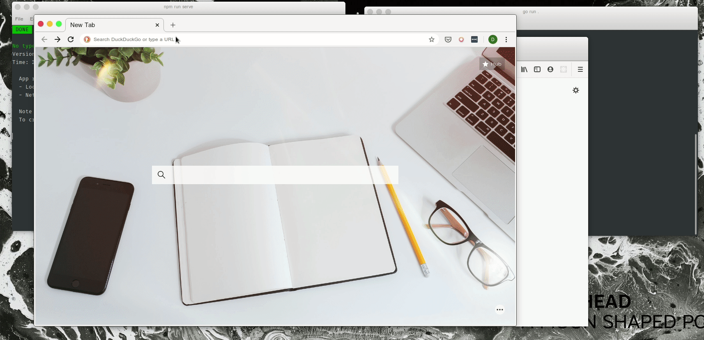

# VCHAT

Vue.js based real time chat using WebSockets (backend agnostic as long as sockets are supported). Meant as a demo FE for [my Golang web-socket server](https://github.com/sharmarajdaksh/chat-microservice).

For instructions on how to run this on your computer, see SETUP.md.
